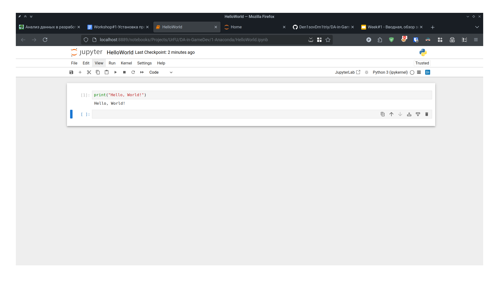
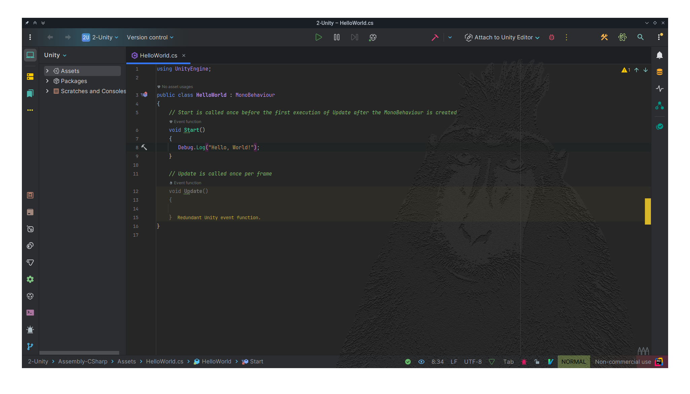
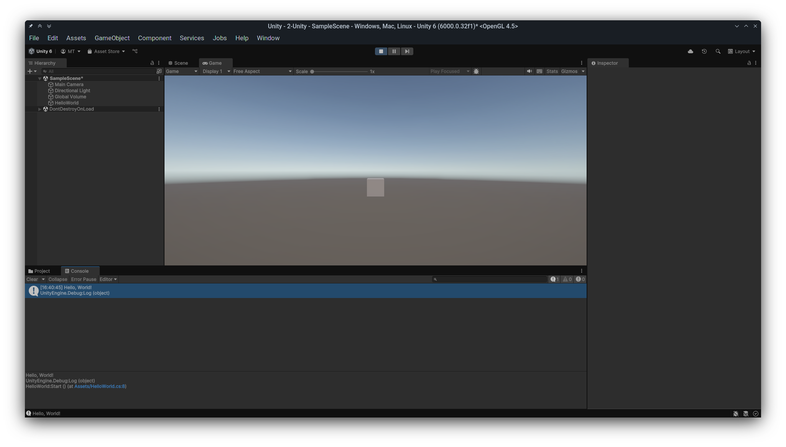

# АНАЛИЗ ДАННЫХ И ИСКУССТВЕННЫЙ ИНТЕЛЛЕКТ В РАЗРАБОТКЕ ИГР

Отчет по лабораторной работе #1 выполнил:

- Торопов Матвей Николаевич
- РИ230931

Отметка о выполнении заданий (заполняется студентом):

| Задание | Выполнение | Баллы |
| ------ | ------ | ------ |
| Задание 1 | * | 60 |
| Задание 2 | * | 20 |
| Задание 3 | * | 20 |

знак "*" - задание выполнено; знак "#" - задание не выполнено;

Работу проверили:

- к.т.н., доцент Денисов Д.В.
- к.э.н., доцент Панов М.А.
- ст. преп., Фадеев В.О.

[](https://nodesource.com/products/nsolid)

[](https://travis-ci.org/joemccann/dillinger)

Структура отчета

- Данные о работе: название работы, фио, группа, выполненные задания.
- Цель работы.
- Задание 1.
- Код реализации выполнения задания. Визуализация результатов выполнения (если применимо).
- Задание 2.
- Код реализации выполнения задания. Визуализация результатов выполнения (если применимо).
- Задание 3.
- Код реализации выполнения задания. Визуализация результатов выполнения (если применимо).
- Выводы.
- ✨Magic ✨

## Цель работы

Установить необходимое программное обеспечение, которое пригодится для создания интеллектуальных моделей на Python. Рассмотреть процесс установки игрового движка Unity для разработки игр.

## Задание 1

### Написать программу Hello World на Python с запуском в Jupiter Notebook

Ход работы:

Установить Anaconda и запустить в Jupyter Notebook проект Hello World!



```py
# %%
print("Hello, World!")

# %%
```

## Задание 2

### Написать программу Hello World на C# с запуском на Unity




```cs
using UnityEngine;

public class HelloWorld : MonoBehaviour
{
    // Start is called once before the first execution of Update after the MonoBehaviour is created
    void Start()
    {
       Debug.Log("Hello, World!"); 
    }

    // Update is called once per frame
    void Update()
    {
        
    }
}
```

## Задание 3

### Оформить отчет в виде документации на github (markdown-разметка)

[Отчёт](https://github.com/Philainel/DA_in-GameDev-lab1) оформлен
3

В процессе работы я установил среду Anaconda, открыл Jupyter Notebook, а так-же запустил в нём программу Hello, World на языке Python. Затем, я установил Unity Hub, загрузил в нём редактор Unity 6 и создал пустой 3D проект. В нем, с помощью IDE Rider я написал скрипт для игрового объекта, который при старте пишет в консоль строку "Hello, World!".

| Plugin | README |
| ------ | ------ |
| Dropbox | [plugins/dropbox/README.md][PlDb] |
| GitHub | [plugins/github/README.md][PlGh] |
| Google Drive | [plugins/googledrive/README.md][PlGd] |
| OneDrive | [plugins/onedrive/README.md][PlOd] |
| Medium | [plugins/medium/README.md][PlMe] |
| Google Analytics | [plugins/googleanalytics/README.md][PlGa] |

## Powered by

**BigDigital Team: Denisov | Fadeev | Panov**
